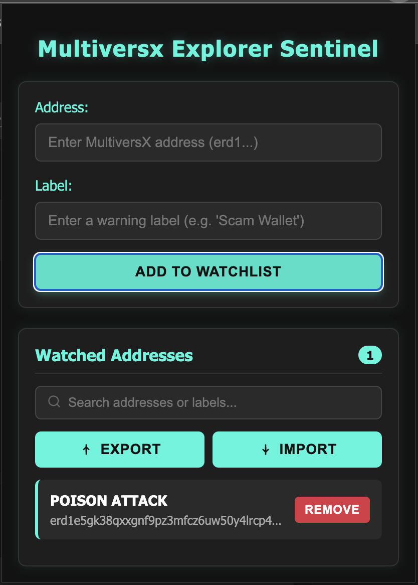
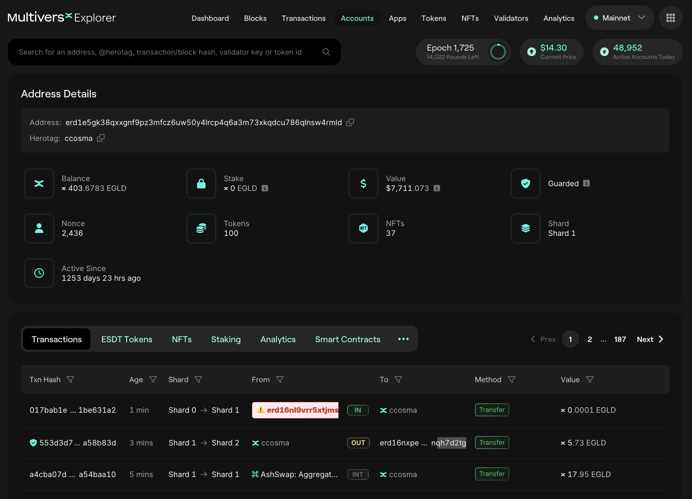

# MultiversX Explorer Sentinel


A Chrome extension that enhances the MultiversX Explorer experience by highlighting and labeling potentially dangerous addresses.

[](https://opensource.org/licenses/MIT)
[]()

## 🛡️ Features

- **Address Watchlist**: Maintain a personal watchlist of MultiversX addresses with custom labels
- **Visual Alerts**: Automatically highlights watched addresses with eye-catching visual styles
- **Transaction Monitoring**: Identifies flagged addresses in transaction tables and account details
- **Search Functionality**: Easily find and manage addresses in your watchlist
- **Modern UI**: Clean, dark-themed interface with intuitive controls
- **Blacklist Import/Export**: Import and export your blacklist as JSON files

## 📸 Screenshots

<div align="center">
  
  <p><em>Extension popup interface for managing watched addresses</em></p>
  
  
  <p><em>Address highlighting on MultiversX Explorer</em></p>
</div>

## 🚀 Installation

### Chrome Web Store (Coming Soon)

The Chrome Web Store listing is coming soon. Please check back later.

### Manual Installation (Developer Mode)

1. Download or clone this repository to your local machine
2. Open Chrome and navigate to `chrome://extensions/`
3. Enable "Developer mode" using the toggle in the top-right corner
4. Click "Load unpacked" and select the directory containing the extension files
5. The extension should now appear in your browser toolbar

## 🔧 Usage

### Adding an Address to Your Watchlist

1. Click the MultiversX Explorer Sentinel icon in your Chrome toolbar
2. Enter the MultiversX address (starting with `erd1`) in the "Address" field
3. Add a descriptive label (e.g., "Known Scammer", "Suspicious Wallet") in the "Label" field
4. Click "Add to Watchlist"

### Managing Your Watchlist

- **Search**: Use the search bar to filter addresses or labels in your watchlist
- **Remove**: Click the "Remove" button next to any address to delete it from your watchlist
- **Import/Export**: Use the "Import" and "Export" buttons to manage your blacklist as JSON files

### Viewing Highlighted Addresses

1. Navigate to [MultiversX Explorer](https://explorer.multiversx.com/)
2. Any addresses in your watchlist will be automatically highlighted with your custom label
3. Hover over highlighted addresses for additional information

## 🧩 Technical Details

MultiversX Explorer Sentinel works by:

1. Storing your watchlist in Chrome's sync storage (synced across your devices if you're signed into Chrome)
2. Injecting a content script into MultiversX Explorer pages
3. Scanning for addresses in specific page elements (headers, transaction tables)
4. Applying custom CSS styles to highlight watched addresses
5. Adding warning icons and replacing address display with your custom labels

The extension doesn't collect any personal data or send information to external servers.

## 🛠️ Development

### Prerequisites

- Google Chrome or Chromium-based browser
- Basic knowledge of HTML, CSS, and JavaScript

### Project Structure

```
├── manifest.json       # Extension configuration
├── popup.html          # Popup UI template
├── popup.js            # Popup functionality
├── content.js          # MultiversX Explorer page integration
├── styles.css          # Highlighting styles
├── images/             # Extension icons in multiple sizes
└── docs/               # Documentation and screenshots
```

### Local Development

1. Make your changes to the code
2. Reload the extension in `chrome://extensions/` by clicking the refresh icon
3. Test your changes on the MultiversX Explorer


## 📄 License

This project is licensed under the MIT License - see the [LICENSE](LICENSE) file for details.

## 🤝 Contributing

Contributions are welcome! Please check the [CONTRIBUTING.md](CONTRIBUTING.md) file for guidelines.

## 🔗 Links

- [GitHub Repository](https://github.com/javi4554/multiversx-explorer-sentinel)
- Chrome Web Store: Coming soon
- [Report Issues](https://github.com/javi4554/multiversx-explorer-sentinel/issues)

## 🙏 Acknowledgements

- [MultiversX](https://multiversx.com/) for their blockchain explorer
- All contributors who help improve this extension

---

<div align="center">
  <p>Created with ❤️ for the MultiversX community</p>
  <p>© 2025 MultiversX Explorer Sentinel</p>
</div>
